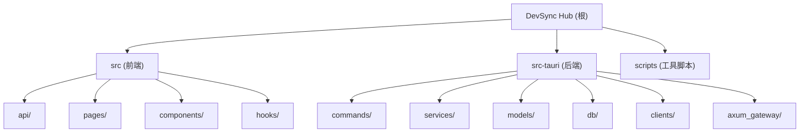

# DevSync Hub

## 项目愿景

DevSync Hub 是一款跨平台桌面客户端，专注于**开发团队项目进度协同管理**。基于 Tauri 2 构建，集成 GitLab 提交同步、迭代管理、需求追踪、SQL 变更管理和 AI 日报/周报自动生成，帮助开发者在本地高效管理多项目开发流程。

---

## 架构总览

项目采用 **Tauri 2 桌面应用架构**，前后端分离但打包为单一可执行文件：

- **前端**：React 19 + TypeScript + TailwindCSS，通过 Tauri IPC (`invoke`) 与后端通信
- **后端**：Rust (Tauri 进程内)，使用 rusqlite 操作本地 SQLite 数据库
- **HTTP 网关**：内嵌 Axum HTTP 服务 (端口 3721)，提供 SSE 实时事件推送
- **外部集成**：GitLab REST API (提交同步)、DeepSeek Chat API (AI 报告生成)

### 通信模型

```
[React 前端] --Tauri IPC invoke--> [Rust commands] --> [services] --> [SQLite DB]
[React 前端] <--SSE (port:3721)--- [Axum gateway] <--- [services 发布事件]
[Rust services] --HTTP--> [GitLab API] / [DeepSeek API]
```

### 数据库

SQLite 本地存储，14 张业务表：project, iteration, iteration_project, pending_sql, sql_env_config, sql_execution_log, report, report_template, api_key, system_setting, git_commit, requirement, requirement_project, work_item_link。

数据库文件位置：
| 平台 | 路径 |
|------|------|
| macOS | `~/Library/Application Support/devsync-hub/devsync.db` |
| Windows | `%APPDATA%/devsync-hub/devsync.db` |
| Linux | `~/.local/share/devsync-hub/devsync.db` |

---

## 模块结构图



---

## 模块索引

| 模块路径 | 语言 | 职责 | 入口文件 |
|---------|------|------|---------|
| `src/` | TypeScript + React | 前端 UI 层：页面、组件、API 调用、路由 | `src/main.tsx` |
| `src-tauri/` | Rust | 后端核心：IPC 命令、业务服务、数据库、外部 API 客户端 | `src-tauri/src/main.rs` |
| `scripts/` | JavaScript | 数据迁移工具（PostgreSQL 导出脚本） | `scripts/export-pg-data.js` |

---

## 运行与开发

### 环境要求

- Node.js >= 18
- Rust >= 1.75
- Tauri CLI 2.x

### 常用命令

```bash
# 安装前端依赖
npm install

# 开发模式（前后端同时启动）
cargo tauri dev

# 仅启动前端开发服务器
npm run dev

# 生产构建
cargo tauri build

# 前端构建
npm run build

# 运行前端测试
npm run test

# 运行 Rust 测试
cd src-tauri && cargo test

# 报告验证工具
cd src-tauri && cargo run --bin report_verify -- <export_json> <start_date> <end_date> [author_email]
```

### 关键配置

| 配置项 | 说明 | 配置位置 |
|--------|------|----------|
| DeepSeek API URL | AI 服务地址 | 系统设置页面 (system_setting 表) |
| DeepSeek API Key | AI 报告生成密钥 | 系统设置页面 |
| Git 作者邮箱 | 过滤提交记录 | 系统设置页面 |
| 全局 GitLab Token | 所有项目共用的 GitLab 访问令牌 | 系统设置页面 |
| 项目级 GitLab Token | 可覆盖全局令牌 | 项目详情配置 |

---

## 测试策略

| 层级 | 框架 | 当前状态 |
|------|------|----------|
| 前端单元测试 | Vitest + jsdom + React Testing Library + MSW | 测试基础设施已配置，**暂无测试文件** |
| 后端单元测试 | Rust 内置 #[test] | `report_service.rs` 包含 4 个单元测试 |
| 后端集成测试 | `report_verify` 二进制工具 | 基于导出 JSON 的端到端验证 |

### 前端测试配置

- 测试配置文件：`vitest.config.ts`
- 测试环境：jsdom
- 测试文件模式：`src/**/*.{test,spec}.{ts,tsx}`
- Setup 文件：`src/test/setup.ts`

### 后端测试

- `report_service::tests` 模块包含：需求提取、项目名匹配、日报周报聚合的单元测试
- `report_verify` 二进制工具可基于导出数据验证报告生成逻辑

---

## 编码规范

### 前端 (TypeScript/React)

- 使用 `@` 路径别名引用 `src/` 下的模块
- 通过 `invoke()` (Tauri IPC) 调用后端，不使用 REST API
- 状态管理使用 TanStack Query v5（`useQuery` / `useMutation`）
- UI 基础组件基于 Radix UI + TailwindCSS (shadcn/ui 风格)
- 暗色模式通过 `class` 策略切换
- ESLint 配置使用 `@typescript-eslint`

### 后端 (Rust)

- 分层架构：`commands` (IPC 入口) -> `services` (业务逻辑) -> `db` (数据访问)
- 模型定义在 `models/` 目录，使用 serde 序列化
- 错误处理统一使用 `AppError` + `AppResult<T>` 类型
- 外部 API 调用封装在 `clients/` 目录
- 数据库操作使用 rusqlite 参数化查询，防止 SQL 注入
- 软删除策略：通过 `state = 0` + `deleted_at` 标记删除
- 异步操作（GitLab 同步等）通过 Tauri 异步命令实现，用 SSE 推送进度

---

## AI 使用指引

### 修改代码时注意

1. **前后端联动**：新增接口需同时修改 `commands/*.rs`（IPC 命令注册）、`services/*.rs`（业务逻辑）、`models/*.rs`（数据模型）和 `src/api/*.ts`（前端 API 调用）
2. **数据库变更**：表结构定义在 `src-tauri/src/db/schema.rs`，使用 `CREATE TABLE IF NOT EXISTS` 模式
3. **IPC 注册**：新命令需在 `src-tauri/src/lib.rs` 的 `invoke_handler` 宏中注册
4. **模块导出**：新文件需在对应目录的 `mod.rs` 中声明
5. **SSE 事件**：通过 `axum_gateway::sse::publish()` 发布，前端通过 `useSSE` Hook 订阅
6. **GitLab Token 处理**：支持明文和 AES-128 加密两种格式，`project_service.rs` 包含完整的解密逻辑

### 关键业务逻辑

- **提交-需求自动关联**：根据提交信息中的需求编号（如 `ABC-123`）自动关联需求，30 分钟内的无编号提交按时间邻近匹配
- **日报生成**：先按需求归类 Git 提交，再交由 DeepSeek API 润色
- **周报生成**：优先从当周日报聚合，无日报时回退到 Git 提交
- **SQL 环境追踪**：每个项目有独立的环境配置，SQL 可按环境标记执行状态

---

## 变更记录 (Changelog)

| 时间 | 操作 | 说明 |
|------|------|------|
| 2026-02-14 15:08:46 | 首次生成 | init-architect 全仓扫描，生成根级及模块级 CLAUDE.md |
